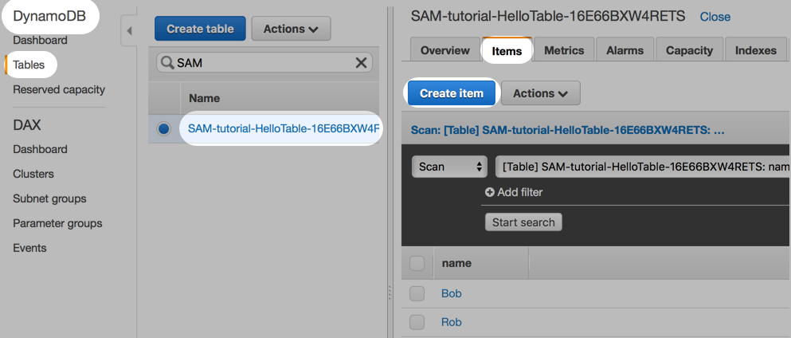

# AWS SAM Tutorial

This tutorial uses AWS SAM to create a hello-world Serverless app with API Gateway, Lambda, and DynamoDB.

Start with the first commit. Then `Checkout` the next commit when you're ready to move onto the next step.

## Wire up the table

Up until now, you've created a DynamoDB table. But it's just sitting there and not wired up to anything.

The `AWS::Serverless::SimpleTable` generates the Table name dynamically. So you need to pass the Table name into the Lambda Environment variable:

```
Resources:
  HelloLambda:
    Type: AWS::Serverless::Function
    Properties:
      ...
      Environment:
        Variables:
          MyTableName: !Ref HelloTable
```

Now that the Lambda is wired to DynamoDB, you need to give the Lambda access:

```
Resources:
  HelloLambda:
    Type: AWS::Serverless::Function
    Properties:
      ...
      Policies:
        - AWSLambdaBasicExecutionRole
        - AmazonDynamoDBFullAccess  
```

Within `index.py`, you can now access the Table:

```
import boto3
import os
import json

def lambda_handler(event, context):
    dynamodb = boto3.resource('dynamodb')
    table = dynamodb.Table(os.environ['MyTableName'])
    table_results = table.scan()

    response = {
        "statusCode": 200,
        "body": json.dumps(table_results)
    }
    return response
```

Some things to note:

* **boto3**: This is the AWS SDK for Python. This is how you access the DynamoDB API.
* **os**: The Environment variable passed into the Lambda is accessed via `os.environ`.
* **table.scan**: In DynamoDB, a Scan just gives back everything in a table.
* **json**: You need a helper package to encode/decode JSON. `json.dumps()` is like `JSON.stringify()`.

## Build and run

```
./deploy.sh
```

Within the AWS console, go to DynamoDB > Tables. You should see a table named `SAM-tutorial-HelloTable-123blah`.

Click on the Table, and select the **Items** tab. Then click **Create Item** and add an entry or two.



## Next step

`Checkout` the next commit when you're ready to move onto the next step.