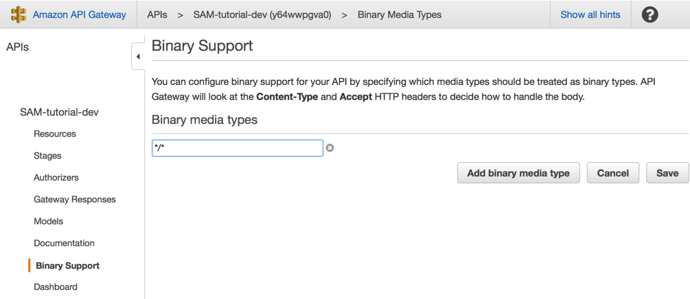
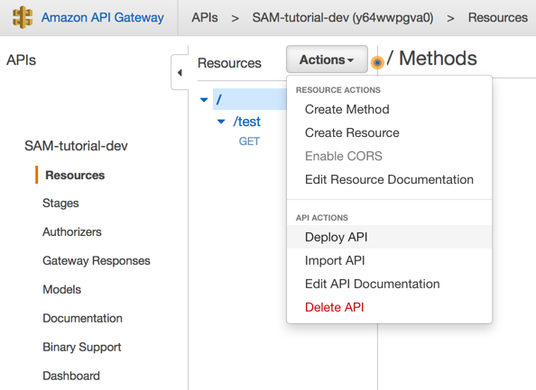

# AWS SAM Tutorial

This tutorial uses AWS SAM to create a hello-world Serverless app with API Gateway, Lambda, and DynamoDB.

Start with the first commit. Then `Checkout` the next commit when you're ready to move onto the next step.

## Add Binary Media Types

API Gateway supports uploading binary content such as gzip or images.

You can set this manually in the AWS console:

API Gateway > SAM-tutorial-dev > Binary Support

And then add the appropriate MIME type, such as `application/octet-stream`:



In order for your changes to stick, you need to re-deploy the API:



When possible, it's best to minimize manual steps.

Now that you're using `AWS::Serverless::Api`, you can actually set this information in Swagger:

```
Resources:
  HelloAPI:
    Type: AWS::Serverless::Api
    Properties:
      StageName: !Sub ${Environment}
      DefinitionBody:
        swagger: 2.0
        ...
        x-amazon-apigateway-binary-media-types:
          - '*/*'
```

## Build and run

```
./deploy.sh
```

Go to API Gateway > SAM-tutorial-dev > Binary Support, and verify that your Binary Media Type is set.

## Next step

`Checkout` the next commit when you're ready to move onto the next step.