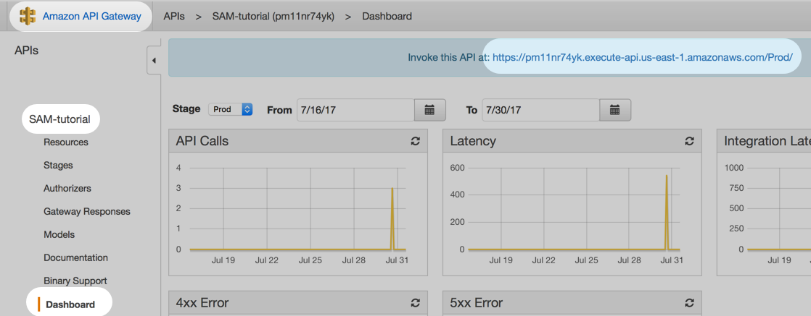

# AWS SAM Tutorial

This tutorial uses AWS SAM to create a hello-world Serverless app with API Gateway, Lambda, and DynamoDB.

Start with the first commit. Then `Checkout` the next commit when you're ready to move onto the next step.

## Add a REST endpoint

This commit adds an **Event** of type `Api`. 

```
Resources:
  HelloLambda:
    Type: AWS::Serverless::Function
    Properties:
      ...
      Events:
        MyEndpoint:
          Type: Api 
          Properties:
            Path: /test
            Method: get
```

The Lambda gets triggered by API Gateway. Since there aren't any `AWS::Serverless::Api` resources defined yet, SAM is smart enough to generate one for you.

## Build and run

Re-deploy the changes:

```
./deploy.sh
```

Within the AWS console, get the URL:

API Gateway > SAM-tutorial > Dashboard

At the top, you should see something like this:

```
https://pm11nr74yk.execute-api.us-east-1.amazonaws.com/Prod/
```



Now, add the path `/test` to the end, like this:

```
https://pm11nr74yk.execute-api.us-east-1.amazonaws.com/Prod/test
```

Browse to the url, and you should see the following:

```
Hello from SAM Tutorial
```


## Next step

`Checkout` the next commit when you're ready to move onto the next step.