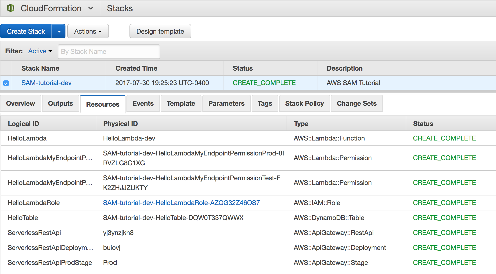

# AWS SAM Tutorial

This tutorial uses AWS SAM to create a hello-world Serverless app with API Gateway, Lambda, and DynamoDB.

Start with the first commit. Then `Checkout` the next commit when you're ready to move onto the next step.

## Add a Stage

## Build and run

Delete the `SAM-tutorial` CloudFormation stack.

Then deploy a new **Dev** stack:

```
./deploy.sh
```

Go to API Gateway > Dashboard and get the URL.

Visit the URL, and the table results should be empty.

Also, go to CloudFormation > SAM-tutorial-dev > Resources tab, and note that each resource has the `-dev` suffix.



## Next step

`Checkout` the next commit when you're ready to move onto the next step.