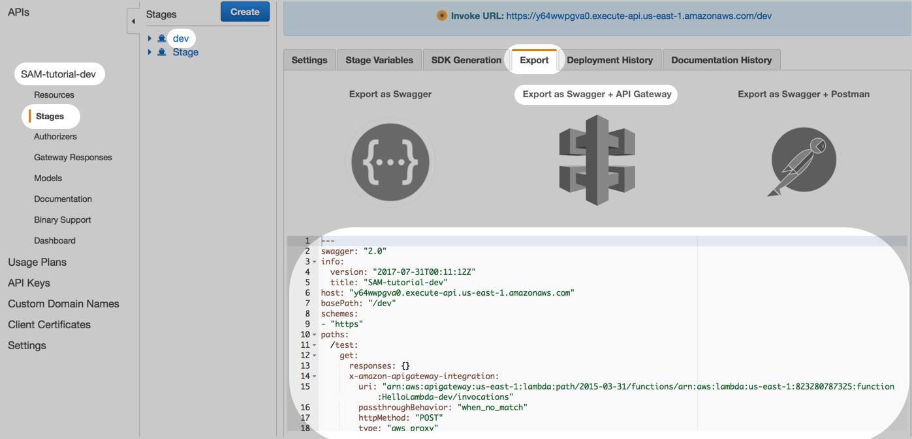

# AWS SAM Tutorial

This tutorial uses AWS SAM to create a hello-world Serverless app with API Gateway, Lambda, and DynamoDB.

Start with the first commit. Then `Checkout` the next commit when you're ready to move onto the next step.

## Change the API Gateway Stage

So far, the URL has been in the format:

```
https://yj3ynzjkh8.execute-api.us-east-1.amazonaws.com/Prod/test
```

The URL still says `Prod`, even when you deploy to `dev`. 

To fix this, you need to use `AWS::Serverless::Api`, rather than relying on AWS SAM to do everything based on the Lambda event.

```
  HelloAPI:
    Type: AWS::Serverless::Api
    Properties:
      StageName: !Sub ${Environment}
```

First, you pass in the `Environment` parameter into the `StageName`. This creates a Stage named `dev` in API Gateway.

The `AWS::Serverless::Api` resource expects a Swagger document. Swagger is a specification for defining APIs.

You attach the Swagger document inline under `DefinitionBody`:

```
      DefinitionBody:
        swagger: 2.0
        info:
          title:
            Ref: AWS::StackName
        paths:
          /test:
            get:
              x-amazon-apigateway-integration:
                httpMethod: POST
                type: aws_proxy
                uri:
                  !Sub arn:aws:apigateway:${AWS::Region}:lambda:path/2015-03-31/functions/${HelloLambda.Arn}/invocations
              responses: {}
```

The Swagger syntax can be pretty intimidating. Fortunately, you can just export it from a API Gateway:

API Gateway > SAM-tutorial-dev > Stages > dev > Export > Export as Swagger + API Gateway



## Build and run

Now try hitting the URL. But this time, use `dev` instead of `Prod`.

```
https://y64wwpgva0.execute-api.us-east-1.amazonaws.com/dev/test
```

## Next step

`Checkout` the next commit when you're ready to move onto the next step.